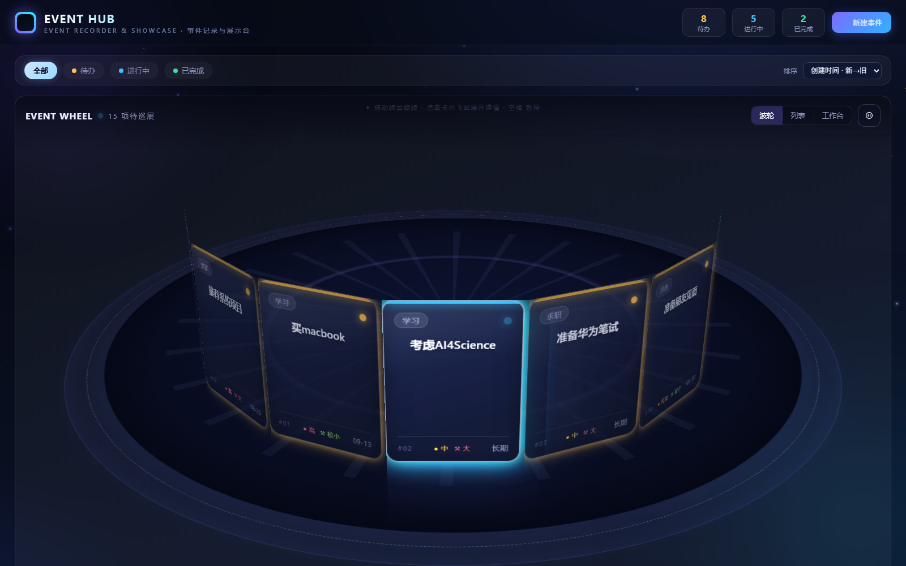
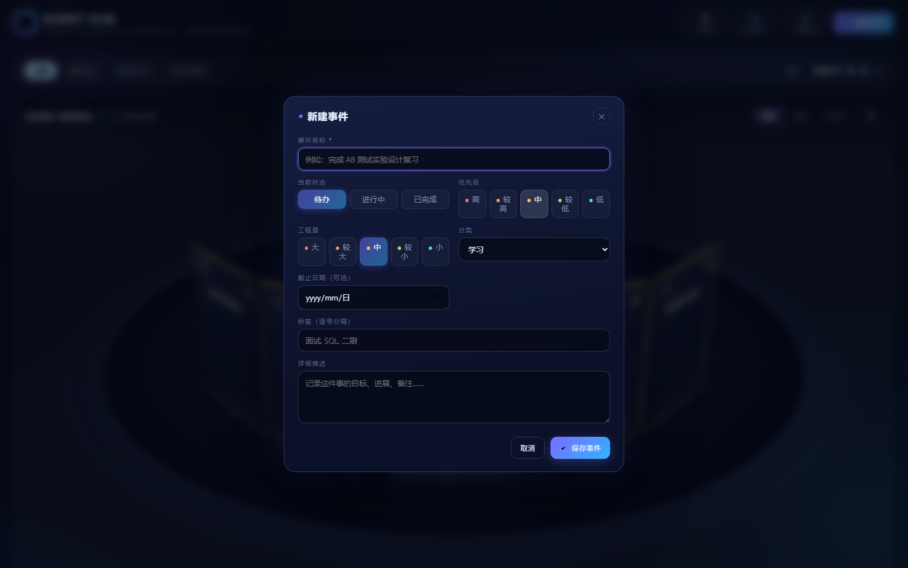
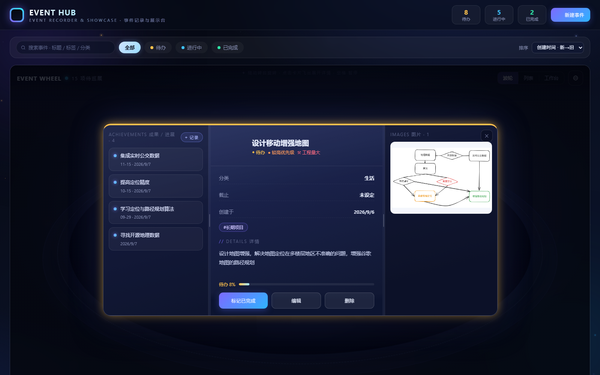

# EVENT HUB · 个人事件展示台

一个完全本地运行的个人事件记录与项目规划工具：以 3D 波轮展示台呈现事件卡片，内置完全离线可用的 Excalidraw 画布工作台，画布图可直接附加到事件上。

## 功能

- **3D 波轮展示台**：事件卡片环绕成环（`rotateY` 3D 轮盘），支持拖拽旋转、自动轮播、点击聚焦
- **列表视图**：与波轮同数据源的平铺列表，方便浏览筛选
- **事件管理**：新建 / 编辑 / 删除，含状态（待办 / 进行中 / 已完成）、优先级 5 档（高 / 较高 / 中 / 较低 / 低）、工程量 5 档（大 / 较大 / 中 / 较小 / 小）、分类、标签、截止日期
- **工作台模式**：内嵌 Excalidraw 编辑器（本地部署，完全离线），支持多画布、自动保存、PNG / SVG 导出
- **存到事件**：工作台画布一键导出为 PNG 附加到任意事件，点开事件后图片与事件信息**并排展示**，可全屏查看、删除
- **本地持久化**：事件与画布均为 JSON 文件存储，不依赖任何外部服务

## 界面预览

主页 · 3D 波轮展示台：



新建事件弹窗：



事件详情 · 画布图片并排展示：



## 项目结构

```
event-hub/
├── index.html            # 单文件前端应用（3D 波轮 + 列表 + 工作台 + 事件详情）
├── serve.js              # Node.js 静态服务器 + 数据 API
├── vendor/               # 本地化前端依赖（React 18 + Excalidraw 0.17.6 UMD，离线可用）
├── excalidraw-assets/    # Excalidraw 字体（woff2，运行时本地加载）
├── boards/               # 画布数据（*.json，自动生成，不入库）
└── events.json           # 事件数据（首次运行时自动创建，不入库）
```

## 快速开始

需要 [Node.js](https://nodejs.org/)（v18+），无需安装任何 npm 依赖：

```bash
node serve.js
```

然后浏览器访问 http://127.0.0.1:8799 即可。

## 数据存储

- 事件数据保存在 `events.json`（JSON 数组，含可选的 base64 图片附件）
- 画布内容保存在 `boards/<画布ID>.json`（Excalidraw 场景数据），画布元信息在 `boards/boards.json`
- 两者均通过 `serve.js` 的 API 读写：`GET/POST /api/events`、`GET/POST/DELETE /api/boards`
- 事件可附带多张工作台导出的 PNG 图片（单请求上限 25MB）
- 个人数据文件已加入 `.gitignore`，不会提交到仓库

## 技术栈

- 原生 HTML / CSS / JavaScript（无构建步骤）
- React 18（UMD，仅为 Excalidraw 运行时依赖）
- Excalidraw 0.17.6（本地 UMD 单文件 + 本地字体，零外部网络请求）
- Node.js 内置模块静态服务器（`http` + `fs`，零 npm 依赖）

## 兼容性

- Windows 10/11、macOS、Linux 均可运行
- 浏览器建议使用 Edge / Chrome 较新版本（3D 变换与 ES2018+）
